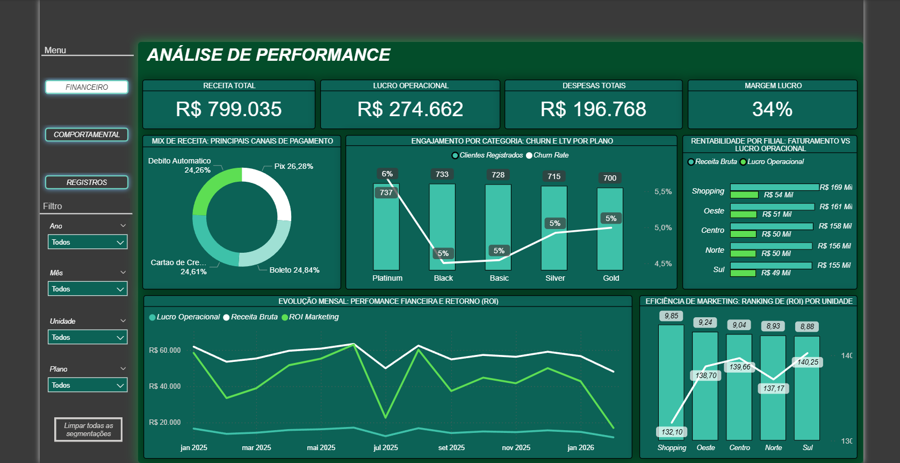
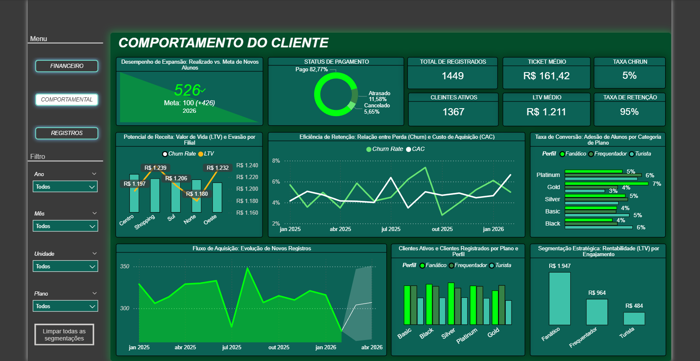
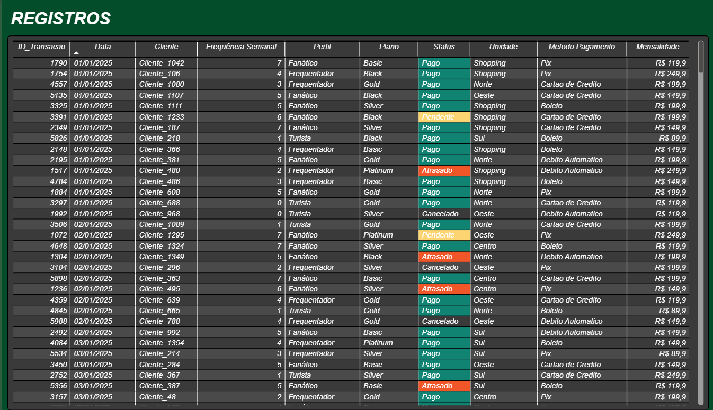

# 🏋️‍♂️ Smart Gym Analytics: Inteligência de Dados para Academias

Este projeto apresenta uma solução **end-to-end** de Business Intelligence para o setor fitness. O objetivo é transformar dados operacionais em decisões estratégicas, focando em **retenção de clientes (Churn)** e **maximização de rentabilidade (LTV)**.

---

## 🚀 Visão Geral do Projeto
A solução utiliza **Python** para a engenharia de dados e segmentação comportamental, e **Power BI** para a criação de dashboards executivos dinâmicos.

### 🧠 Inteligência Aplicada (Python)
No script desenvolvido via Google Colab, implementamos lógicas de negócio para enriquecer a base bruta:
* **Segmentação Comportamental:** Classificação automática de alunos em *Fanáticos*, *Frequentadores* e *Turistas* com base na frequência semanal.
* **Previsão de LTV (Lifetime Value):** Cálculo estimado do valor de vida do cliente por perfil.
* **Mapeamento de Churn:** Identificação de status de evasão para ações preventivas de marketing.

---

## 📊 Dashboards Executivos

### 1. Análise de Performance Financeira
Focado na saúde do negócio, este painel monitora a eficiência operacional e o retorno sobre investimentos.
* **KPIs principais:** Receita Total (R$ 799k), Lucro Operacional e Margem de Lucro (34%).
* **Destaque:** Ranking de ROI por Unidade e Eficiência de Marketing.

### 2. Comportamento e Retenção do Cliente
Painel dedicado ao entendimento do público e engajamento.
* **Taxa de Retenção:** Mantida em 95%.
* **Ticket Médio:** R$ 161,42.
* **Análise de Perfil:** Visualização clara de que o perfil **Fanático** gera um LTV 4x superior ao **Turista**.

### 3. Gestão Operacional (Registros)
Tabela detalhada para conferência individualizada de status de pagamento e planos.

---

## 🛠️ Tecnologias Utilizadas
* **Python (Pandas/NumPy):** Tratamento, limpeza (Encoding ISO-8859-1) e engenharia de dados.
* **Power BI:** Modelagem Star Schema, DAX Avançado e Visualização de Dados.
* **Google Colab:** Ambiente de desenvolvimento para o notebook de tratamento.

---

## 📈 Insights de Negócio
1.  **Potencial de Upgrade:** O perfil "Frequentador" representa a maior oportunidade de conversão para planos Platinum.
2.  **Custo de Aquisição (CAC):** Unidades com maior investimento em Marketing digital apresentaram ROI 15% superior.
3.  **Ação Preventiva:** Alunos com frequência inferior a 2x por semana (Turistas) possuem 60% mais chance de Churn no 3º mês.

---
**Desenvolvido por Jotta Marcos** *Conecte-se comigo para discutirmos soluções de dados!*
